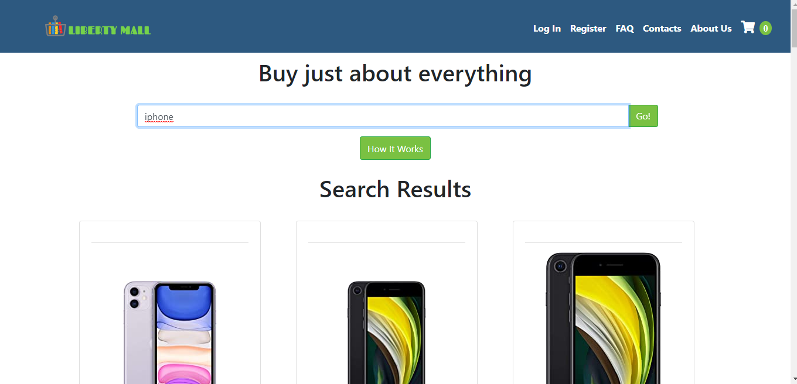
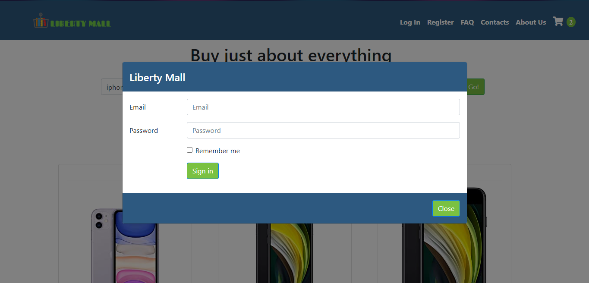
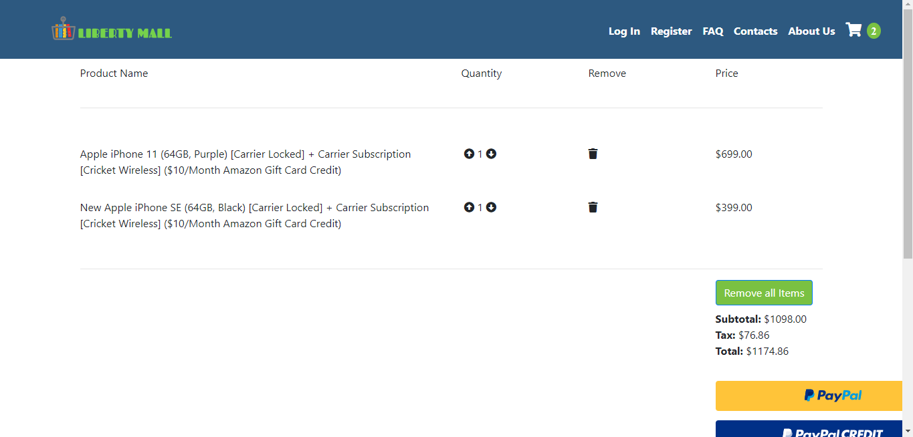

# Liberty Mall

An E-Commerce website that uses an API to gather product information and sell to the public. Frontend was built on a
React.js framework using HTML, CSS, and JavaScript. Backend was build on a Flask framework using Python and
SQLAlchemy

> By [Kevin Castillo](https://www.linkedin.com/in/kevinjcastillo/)

## Installation
```
$ git clone https://github.com/KJCastillo/AA-KC-MD-Final-Project-Online-Store
$ npm install
```
For Windows, Mac, Linux or Gitpod, start the webpack server with live reload:
```
$ npm run start
```

**Home Page Preview**
- Home page was built using React Bootstrap. Search bar uses a product data API called Rainforest API.


**Login Modal Preview**
- Login Modal was built Using React Bootstrap. Login functionality was created using JavaScript on a React framework. User information is saved using Python on a Flask framework.


**Shopping Cart Preview**
- Cart functionality was created using JavaScript on a React Framework. Price for products was determined by fetching price data through Rainforest API.

